= A Task Executor GUI
:source-highlighter: rouge
:toc: left

[.text-right]
This documentation is for `gui-executor` ≥ v0.18.0. image:images/github.png[link=https://github.com/IvS-KULeuven/gui-executor,width=40px]

== What is the hype?

Execute your Python functions _not within_, but _as a GUI_ without writing any GUI code.

By decorating your function, it is recognised as a task and a button will be created in the Task GUI.
The parameters of your function will be presented in a panel of input fields of different kinds.
The output of your function will be printed in rich text.

The Task GUI was originally developed to support test operators to quickly execute isolated tasks for an experiment in a lab. We had developed a complex machinery with microservices and scripts that would run from a Python REPL, however, after initial implementation and when going into routine testing in the lab, it turned out that running the scripts from the Python REPL was cumbersome, most of the time a test function was copied from a procedure and executed without changing any parameters. It would be much more convenient for a test operator to execute such script or functions through a dedicated GUI where each button would represent an isolated action to run a specific test. Since we work in a research environment, this sounded as a useful tool in other labs and environments. That's how the `gui-executor` was born.

NOTE: The Task GUI is *not* an IDE and as such it doesn't replace –by far– applications like Spyder, PyCharm or VSCode. The Task GUI is not a developer tool but an operational tool to help executing simple task or functions from a standardised GUI.

== Installation

The `gui-executor` package can be installed via https://pypi.org[PyPI]. You should preferably install the package inside a virtual environment unless you want it to be available from your global Python installation.

----
$ pip install [--upgrade] gui-executor
----

Use the `--help` option to see the commandline options for the `gui-executor`:

[%nowrap]
----
$ gui-executor --help
usage: gui-executor [-h] [--version] [--verbose] [--cmd-log CMD_LOG] [--module-path MODULE_PATH]
                    [--kernel-name KERNEL_NAME] [--config CONFIG] [--logo LOGO] [--app-name APP_NAME]
                    [--debug] [--single]

options:
  -h, --help            show this help message and exit
  --version, -V         print the gui-executor version number and exit
  --verbose, -v         print verbose information, increased verbosity level with multiple occurrences
  --cmd-log CMD_LOG     location of the command log files
  --module-path MODULE_PATH
                        module path of the Python modules and scripts
  --kernel-name KERNEL_NAME
                        the kernel that will be started by default, python3 if not given
  --config CONFIG       a YAML file that configures the executor
  --logo LOGO           path to logo PNG or SVG file
  --app-name APP_NAME   the name of the GUI app, will go in the window title
  --debug, -d           set debugging mode
  --single              the UI can be started only once (instead of multiple times)
----

[#tasks-gui]
== The Tasks GUI

The Tasks GUI is a generic GUI that allows the user to execute standard tasks by clicking the task button and provide the necessary arguments. An example of such a Task GUI is given in the screenshot below. This screenshot is taken as an example and showcase from a project I'm working on. In further sections we will create such a task GUI step by step.

.An example Task GUI used in a real project. This type of GUI is generated from seven short Python modules containing simple functions to perform one specific task.
[[csl-task-gui,Figure 1]]
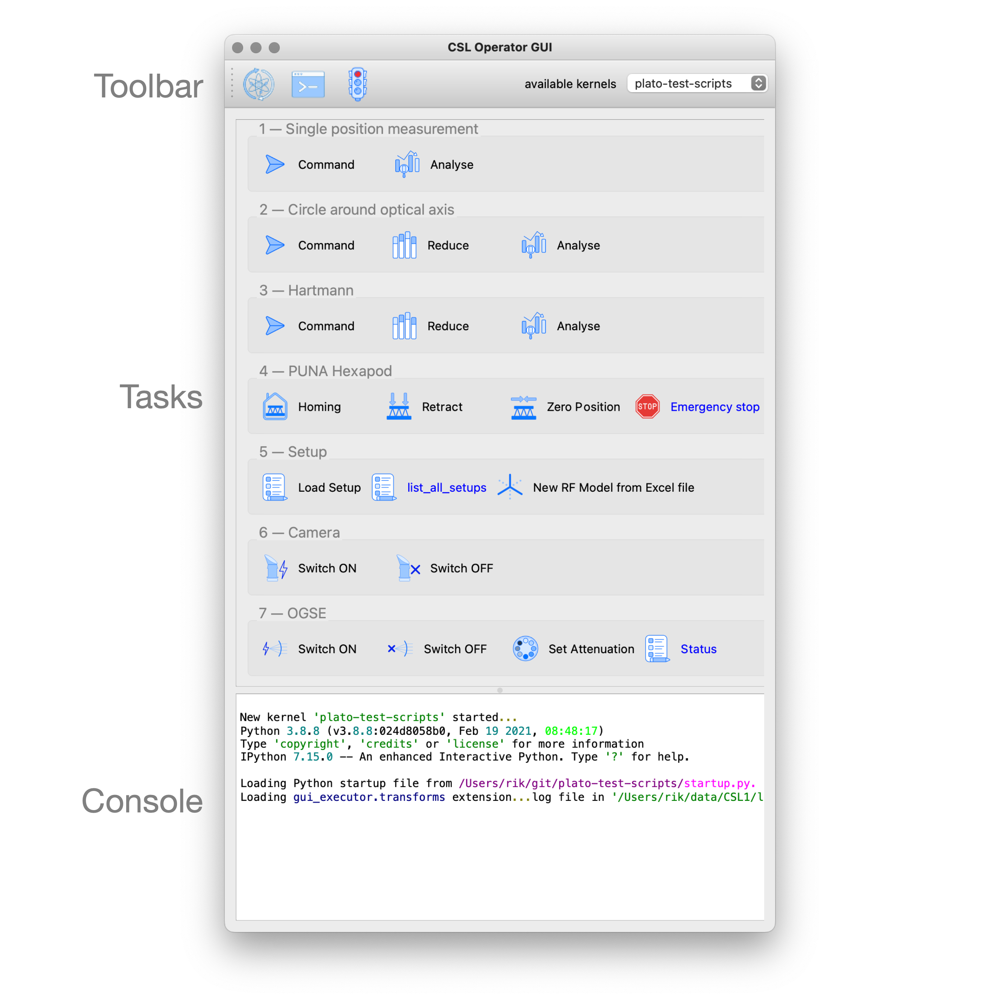

The Task GUI is organised in three panels that are arranged vertically in the window. The top panel is the toolbar to control the Jupyter kernel, the panel at the center contains all the task buttons organised by category, the bottom panel is the console where the output and error messages of the tasks will appear.

When you click on a task button, a fourth panel will appear above the console panel. This is the arguments panel where you can specify all arguments required for the task. Default arguments are shown in gray and can be left to use or overwritten to change. The arguments panel of the selected 'Analyse' task for the 'Circle around optical axis' group is shown below.

.The example Task GUI with arguments panel. The arguments panel is automatically generated by the gui-executor from the arguments and type hints of the Python function.
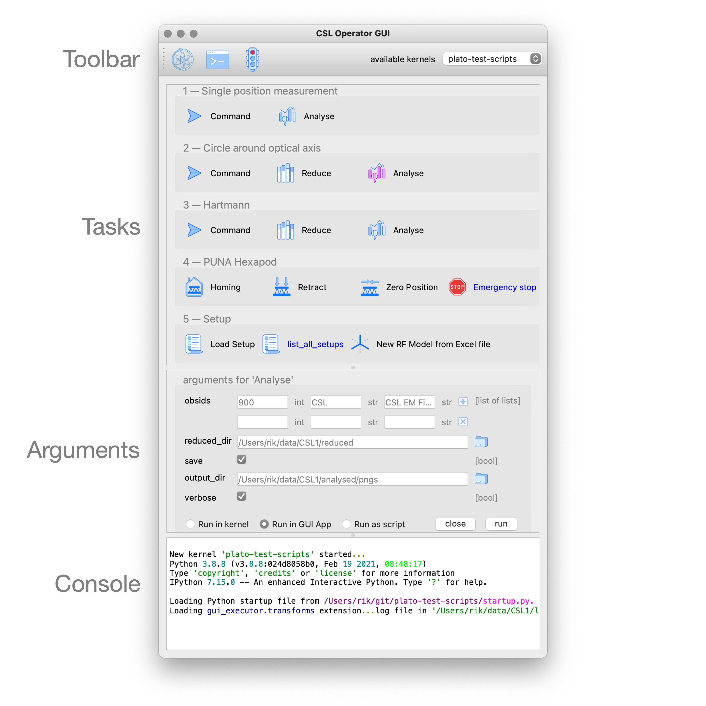

This 'Analyse' task accepts 5 arguments: a list of observation identifiers, the location of the reduced data, an option to save the generated plots in a given output folder, and a flag to make the tasks output more verbose. Since this task will produce plots, we want to execute it as a GUI App. Finally, the 'Close' button hides the arguments panel again and deselects the task button. The 'Run' button executes the task.

When you exit the Task GUI a dialog will pop up asking if you really want to quit. I know, this is annoying, but the reason is that our tasks run code in the background in a Jupyter kernel and this kernel has state, i.e. the response or return values of tasks that you have run. You might not want to lose that information by quiting the application and killing the kernel. So, this dialog gives you the opportunity to abort and save your data.

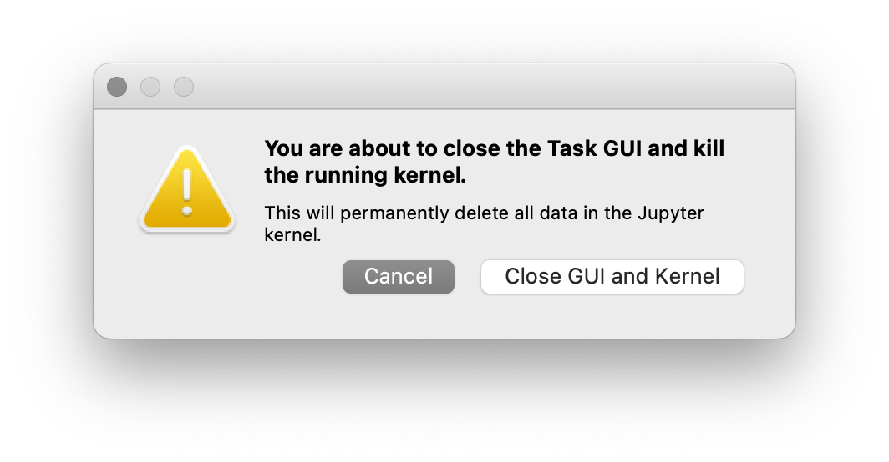

In the rest of this document we will explain how such a GUI as above is created and how you can develop your own version for your specific tasks.

=== Organising your tasks

To build up the Task GUI, we distinguish each task button as a function, several of these functions can be grouped in a Python module (a `.py` file) and all the modules plus additional information needed for the Task GUI is kept in a Python package. The _CSL Operator GUI_ shown in the screenshot above, is located in the package `camtest.csl` and has the following layout:

----
camtest.csl
   ├──────── __init__.py
   ├──────── camera.py
   ├──────── circle.py
   ├──────── hartmann.py
   ├──────── hexapod.py
   ├──────── huber.py
   ├──────── icons
   ├──────── ogse.py
   ├──────── refmodel.py
   └──────── single.py
----

Each of these `.py` files form a group of buttons in the above Task GUI. The `\\__init__.py` file is special, it defines `camtest.csl` as a package, and it also defines the command to start the Task GUI [see section <<init>>]. The `icons` folder contains the graphics for the task buttons and the application icon.

Simply starting the CSL Task GUI from the commandline would be done as follows:

----
$ gui-executor --module-path camtest.csl
----

=== Defining a Task

Let's build our own simple Task GUI and start with the most stated and useless function, _Hello, World!_. We will eventually build a Task GUI with tasks of increasing complexity and guide you through the different steps.

Create a folder `yakkafootnote:['yakka' means 'work' in informal Australian English]` that will be our Task GUI package. In the folder create an empty file `\\__init__.py` and a file named `hello.py`.

----
yakka
   ├──────── __init__.py
   └──────── hello.py
----

The `hello.py` file shall contain the following code:

[source, python]
----
from gui_executor.exec import exec_task

@exec_task(immediate_run=True)  <1>
def hello_world():
    print("Hello, World!")
----
<1> Each task button in the Task GUI is actually a function that is decorated with the `@exec_task` decorator.

Make sure you are at the same directory level as the `yakka` folder and then execute the following command from your terminal. That command will start the Task GUI as shown in the screenshot below.

----
PYTHONPATH=. gui-executor --module-path yakka
----

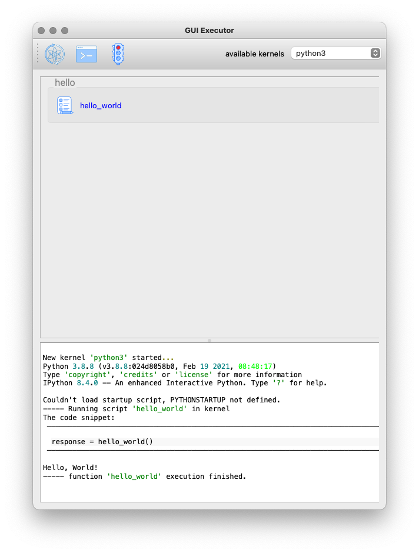

We see the task appearing in the screenshot above. The task text is blue which means it will run immediately when clicked. The tasks name is the name of the function and the task group name is the name of the `.py` file. The icon is the standard icon used for the task buttons. When you click the task button, the Console shows the following output:

----
----- Running script 'hello_world' in kernel <1>
The code snippet:
 ──────────────────────────────────────────
  response = hello_world()  <2>
 ──────────────────────────────────────────

Hello, World! <3>
----- function 'hello_world' execution finished. <4>

----
What do we see in this output:

<1> The script is run in the kernel, that is the Jupyter kernel which is started when the Task GUI starts up. By default, the 'python3' kernel is used as you can see in the toolbar.
<2> The code snippet that is run is shown between two horizontal lines. We see that the function is called without arguments and the return is catched in the variable `response` (which is `None` since the function doesn't return anything).
<3> The string 'Hello, World!' is printed when the function was executed.
<4> A mark that the function execution has finished.

Let's add another task that takes an argument 'name' as a string with the default value of "John".

[source,python,subs="+quotes"]
----
from gui_executor.exec import exec_task

**UI_MODULE_DISPLAY_NAME = "Hello Tasks"**  <1>

@exec_task(immediate_run=True)
def hello_world():
    print("Hello, World!")

**@exec_task(display_name="Hello...")  <2>
def hello_you(name: str = "John"):  <3>
    print(f"Hello, {name}!")
**

----
1. if the global variable `UI_MODULE_DISPLAY_NAME` is defined, its value will be used as the name of the group of buttons in this module.
2. You can give the task button a proper name instead of the function name.
3. The type hint for the argument and the default value are used in the arguments panel in the GUI.

image:images/yakka-02.png[width=40%,align=left]
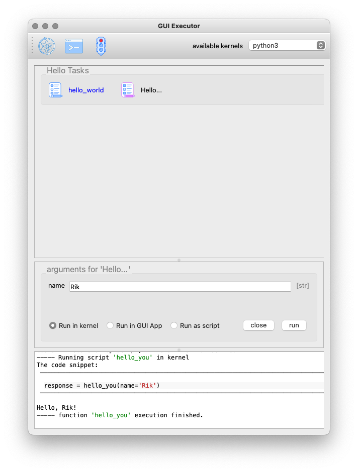

In the screenshot above, you can see the effect of the small changes we made in the `hello.py`. The tasks button group is now called 'Hello Tasks' and the new task we added got the 'Hello...' name instead of the function name. The new task icon has a different color because it is selected. You can also see in the arguments panel that the type hint is picked up and shown in grey and the default name is also filled in grey in the text field. When I put my name there and press the 'Run' button, you can see that the function is called with the proper argument.

// XXXXX: where to describe docstrings and where they show up?

=== The @exec_task decorator

A Task is a function that is decorated with the `@exec_task` decorator. Such a function or task becomes a button in the Task GUI with a default icon. How the task is presented in the Task GUI and how the task is executed depends on the arguments that are passed into the decorator. In this section we will describe these arguments and what their effect is visually and behind the scenes.

The default behaviour is as follows: The function is decorated with `@exec_task()` without any arguments. The task name will be the function name, the task icon will be . When the task is selected, an arguments panel will be shown with a 'Run' button and the Task icon will look like . Click on the 'Run' button will execute the task in the selected Jupyter kernel (by default the 'python3' kernel). This is the behaviour that we have seen in the previous sections.

If you check back on <<csl-task-gui>>, you can see that each of the tasks is visualised with a nice icon and a proper task name, most task names are black but there are some blue task names. All these features are the result from optional parameters on the decorator. Let's describe these parameters now in the following paragraphs. Remember all decorator parameters are optional.

`immediate_run`:: When this parameter is set to True, the task name will be blue and when you click the task, it will run immediately without first showing the arguments panel with a 'Run' button. Don't use this option for tasks that take arguments. This option is usually used for tasks that only print information or emergency action that must run as soon as possible.
`description`:: a string with a short description of the function, intended to be used as a tooltip if no docstring is present for the function.
`display_name`:: a string that will be used as the name of the task (at the right of the button). When this parameter is not given, the function name will be used.
`use_kernel, use_gui_app, use_script_app`:: These flags can be used to specify how the task shall be executed. The default is to execute a task in the Jupyter kernel. Other options are (1) a GUI app which will run the function in a separate process that is a Qt application and (2) a script which will run the function as a script in a separate Python interpreter. Use these parameters exclusively, i.e. only one must be present.
`input_request`:: a tuple of strings to recognise input requests from the task. The GUI will scan the task's stdin channel for a match with any of these strings and if a match is found, the GUI will fire a dialog requesting a 'yes / no' answer. See <<input_requests>> for more detailed information.
`icons`:: This is a tuple of two filepaths that locate the icons that shall be used for the button of this task. The first filepath is the icon for the task button and the second filepath is the icon for the task button when the button is selected. The defaults are  and  respectively.
`allow_kernel_interrupt`:: a flag that, when True, allows the GUI to interrupt the kernel and stop any running task before executing this task. Use this parameter carefully, it is intended for tasks that have an emergency action and need to run immediately regardless if a previous task is still running or not.
`capture_response`:: a string or a tuple of strings that represent the variable(s) in which the result of the function shall be captured. See <<capture_response>> for more detailed information.

=== Your function's parameters

So what about passing arguments to the task. Since a task is just a function, you write your function parameters like any other Python function. The Task GUI will interpret your function parameters and create a panel with input fields that match the type of your parameter (in case you used type hints).

Suppose we have a task to capture an image from a camera and save this image into a file in a folder. Such a function could look like the code below. How that looks in the GUI is shown in the TAB next to the code snippet.

[tabs]
======
Code snippet::
+
[source,python]
----
from gui_executor.exec import exec_task

@exec_task()
def capture_image(camera, exposure_time, aperture, filename, location):
    ...
    image = "Captured image not shown for privacy reasons..."

    return image
----

GUI::
+
image::images/func_param_01.png[width=60%,align=center]

======

There are five parameters for the `capture_image` function and one return value. The GUI shows these parameters in the arguments panel below the task button where you can fill in their values before pressing 'Run'. I have already filled the camera name, the exposure time and aperture, but all arguments are of type `str` since no type hint was used in the functions parameter list. There is also a message saying the return values will be captured in the variable `response`. This variable will be overwritten when the function is executed and is accessible from the Jupyter kernel.

For any given simple function, this is the default behaviour. You do not have to provide more information to run such a function from the Task GUI. All arguments will be passed into the function as strings. When you didn't provide a value, `None` will be passed as an argument. In the screenshot above I have already pressed the 'Run' button, and you can see in the output panel what the arguments look like and what their type is.

Now let's add type hints to the parameters of our function. We will use the string type for the camera name and the filename and location, and we will use a float for the exposure time and an integer for the aperture. For the location, we want to provide a default value.

[tabs]
======
Code snippet::
+
[source,python]
----
from gui_executor.exec import exec_task

@exec_task()
def capture_image(
    camera: str, exposure_time: float, aperture: int,
    filename: str, location: str = "~/data/images"
):
    ...  # here the actual capturing of the image is done
    image = f"Captured image from camera '{camera}' with {exposure_time=} and {aperture=}."
    ...  # here any further processing of the image can be done

    return image
----

GUI::
+
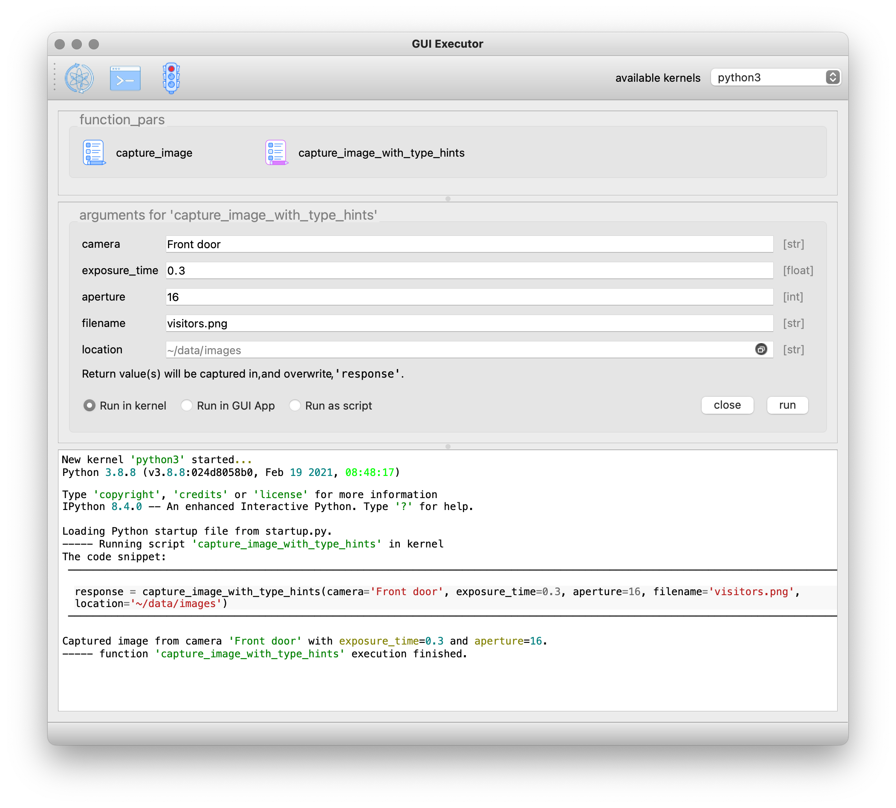

======

If you now have a look at the arguments panel, you will see a lot of small things have changed. Behind the input fields for each parameter there is now the expected type in grey text. The location had a default value which is put as a placeholder in the input text field and there is a small copy icon aligned at the right in that text field. Pressing this icon will copy the default text into the input field and make this text editable. I again already pressed the 'Run' button, and you can see in the output console that the type of the exposure_time argument is 'float', and the type of the aperture argument is 'int'. The return string is also printed with the arguments filled in.

But we can do better. For the filename and location, it would be nice if we could open a file selector box and navigate in our directory structure to select these values. We have done that in the following code snippet where the `filename` has type hint '_FileName_' and `location` has type hint '_Directory_'. These are what we call a _TypeVar_ and both are bound to the _Path_ type. The default for `location` now has changed to a Path value instead of a string.

Another change we added was the `capture_response` parameter of the decorator. The return value of the function is no longer captured in the variable `response`, but in the variable `new_image`.

[tabs]
======
Code snippet::
+
[source,python]
----
from pathlib import Path
from gui_executor.exec import exec_task, FileName, Directory

@exec_task(capture_response='new_image')
def capture_image_file_type_hints(
        camera: str, exposure_time: float, aperture: int,
        filename: FileName, location: Directory = Path("~/data/images")
):
    ...  # here the actual capturing of the image is done

    image = (
        f"Captured image from camera '{camera}' with {exposure_time=} and {aperture=}, "
        f"saving it as {filename=} at {location=}."
    )

    ...  # here any further processing of the image can be done

    return image
----

GUI::
+
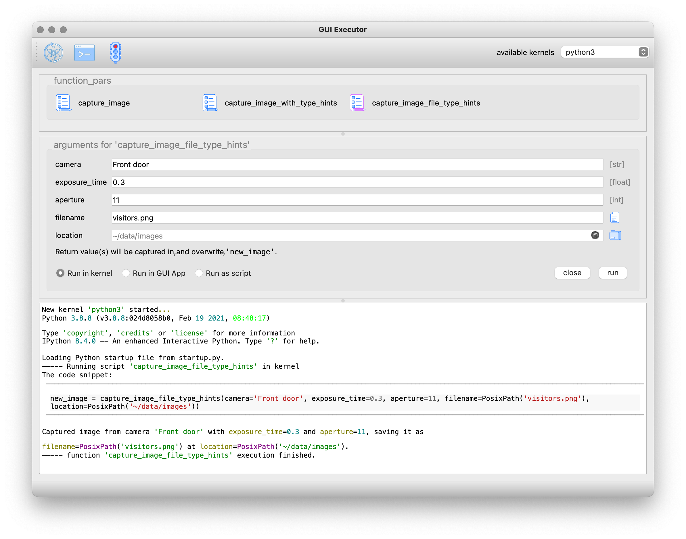

======

If you now select the GUI tab above, the changes in the code result in two new icons ( and 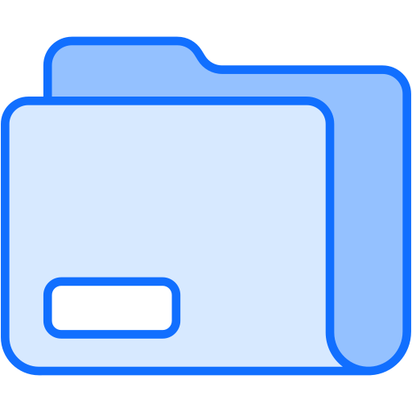) that replace the type behind the filename and location input fields. If you click these icons, a file selector box will open and allow you to select either a filename or a folder from your local disk. If you look at the code snippet printed in the output console, the filename and location arguments to the function are now of type _PosixPath_.

The change with the added decorator parameter `capture_response` is apparent in the arguments panel where it now says the return values will be captured in 'new_image', but also in the output console you can see that the variable name in which the return value is captured is `new_image`. So, this function will now, when it is executed, make the return value available in the kernel as the variable named `new_image`.

Let's go one step further and change the type of the camera name. We have only a limited number of camera's around the house and we don't like to type their name all the time, so, we are going to create a dropdown list (or ComboBox) where we can select the camera we want to capture. Luckily, we do not have to worry about coding this dropdown menu, the Task GUI understands the type hint `Enum` and will automatically create a dropdown box for this parameter. In the following code snippet, we have created a `CameraName` enumeration class and use it as a type hint for the camera parameter.

[tabs]
======
Code snippet::
+
[source,python]
----
from pathlib import Path
from enum import IntEnum
from gui_executor.exec import exec_task, FileName, Directory

class CameraName(IntEnum):
    FRONT_DOOR = 1
    BACK_DOOR = 2
    GARDEN = 3
    GARDEN_HOUSE = 4
    BIRD_HOUSE_1 = 5
    BIRD_HOUSE_2 = 6

@exec_task(capture_response='new_image')
def capture_image_camera_name(
        camera: CameraName, exposure_time: float, aperture: int,
        filename: FileName, location: Directory = Path("~/data/images")
):
    ...  # here the actual capturing of the image is done

    image = (
        f"Captured image from camera '{camera.name}' with {exposure_time=} and {aperture=}, "
        f"saving it as {filename=} at {location=}."
    )

    ...  # here any further processing of the image can be done

    return image
----

GUI::
+
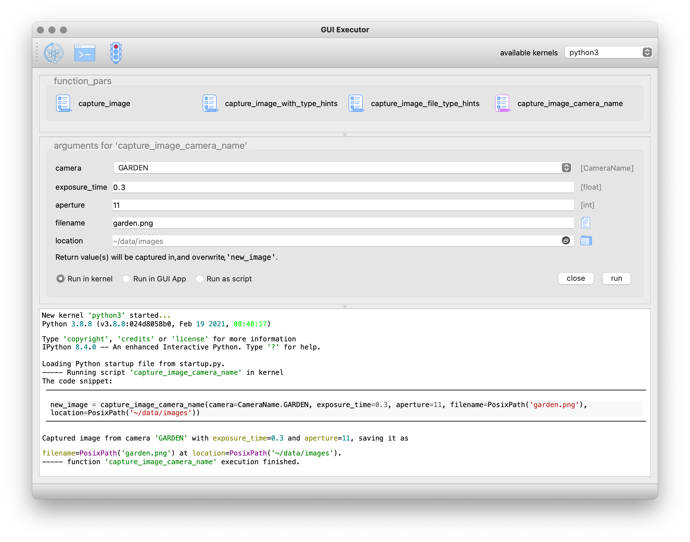

======

In the GUI, you can see that the input field for the `camera` parameter is now a dropdown list. I selected the GARDEN camera already. In the output console, the argument for the function is `CameraName.GARDEN`, and in the f-string that creates the return value, we have to use `camera.name` because that `camera` variable is now an Enum object.

=== Your function's result

Let's move from the function's parameters to its return value(s). Up to now, we have always returned a string which was then printed in rich text in the output console. But what if we have a more complex return value like a table? It turns out that Rich Renderables like Text, Table, Panel, Syntax, etc. all are printed nicely in the output console when you return them from your task.

In the following example, I simulated a task that prints a table from our last bird count day in the backyard. Of course, in a real task this would take additional arguments like the date and other criteria and load the data from a database, but this example should give you a hunch of what is possible. The table is a https://rich.readthedocs.io/en/latest/tables.html[Rich Table] and is returned by the task.

[tabs]
======
Code snippet::
+
[source,python]
----
from pathlib import Path

from gui_executor.exec import exec_task

HERE = Path(__file__).parent.resolve()

@exec_task()
def bird_count(camera: str = "backyard"):

    from rich.table import Table
    table = Table(title=f"Bird Count for {camera}")

    table.add_column("Date", justify="right", style="cyan", no_wrap=True)
    table.add_column("Bird name", style="magenta")
    table.add_column("Number", justify="center", style="green")

    for date, name, number in {
        ("16 Feb 2023", "ChiffChaff", 3),
        ("16 Feb 2023", "Robin", 1),
        ("16 Feb 2023", "Pigeon", 5),
        ("16 Feb 2023", "Magpie", 3),
        ("16 Feb 2023", "Sparrow", 10),
        ("16 Feb 2023", "Great tit", 9),
    }:
        table.add_row(date, name, str(number))

    return table
----

GUI::
+
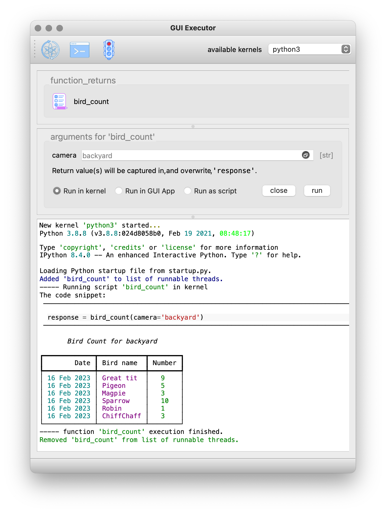

======

=== Your function's output

If you run your function in the kernel, as a GUI App or as a script, your function can output information by e.g. printing, logging, or even displaying images and plots. Output is handled slightly different depending on how you run your function. We will focus here on running in the kernel. For more details about running the GUI App or a script, see <<running_tasks>>.

Actually, our table example above with the bird count can also serve as function output. If we print the table with Rich Console, the output is caught and shown in the output console of the Task GUI almost exactly like if you return the table from the function. Any Rich Renderable that you print in your function will be shown as expected in the output console of the Task GUI.

[tabs]
======
Code snippet::
+
[source,python]
----
from pathlib import Path

from gui_executor.exec import exec_task

HERE = Path(__file__).parent.resolve()

@exec_task()
def print_bird_count(camera: str = "backyard", date: str = "today"):

    from rich.table import Table
    from rich.console import Console

    table = Table(title=f"Bird Count for {camera}")

    table.add_column("Date", justify="right", style="cyan", no_wrap=True)
    table.add_column("Bird name", style="magenta")
    table.add_column("Number", justify="center", style="green")

    for date, name, number in {
        ("16 Feb 2023", "ChiffChaff", 3),
        ("16 Feb 2023", "Robin", 1),
        ("16 Feb 2023", "Pigeon", 5),
        ("16 Feb 2023", "Magpie", 3),
        ("16 Feb 2023", "Sparrow", 10),
        ("16 Feb 2023", "Great tit", 9),
    }:
        table.add_row(date, name, str(number))

    console = Console(width=200)
    console.print(table)

----

GUI::
+
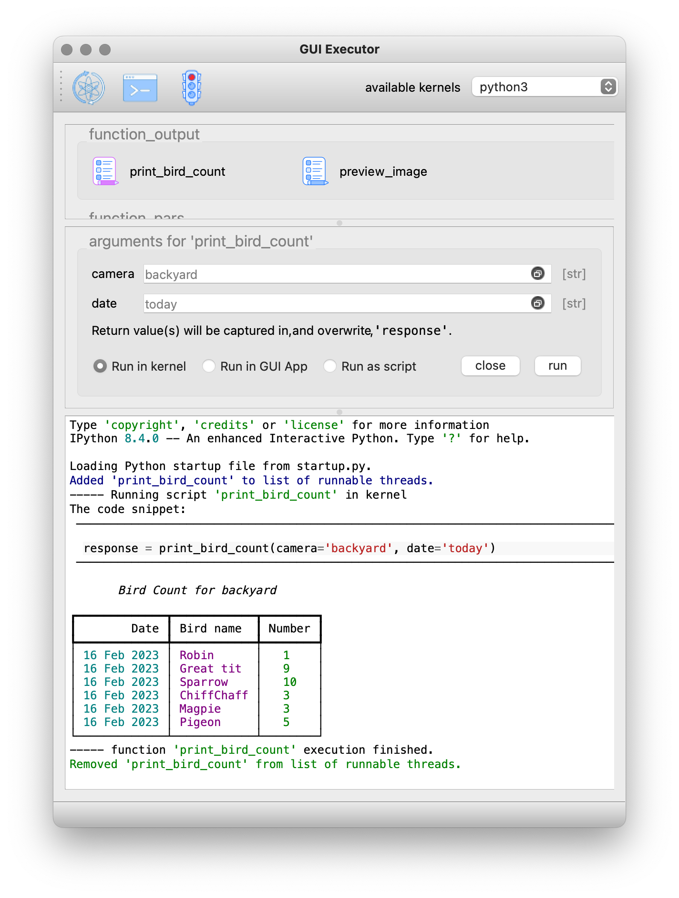

======

Another type that we would want to inspect is the image type. Our camera example above returned a string to illustrate the behaviour we wanted to demonstrate, but we can also use the IPython display function to show images in a separate window.  Let's load one of our bird house pictures in the following example. This loads the image from disk and displays the image in a separate window. You will see in the output console that the image —which is still returned by the task— is captured in the `response` variable and is now printed as `<IPython.core.display.Image object>`. So, we return the actual image object in the variable `response`. We can see this image in the Jupyter QtConsole that can be opened from the second button (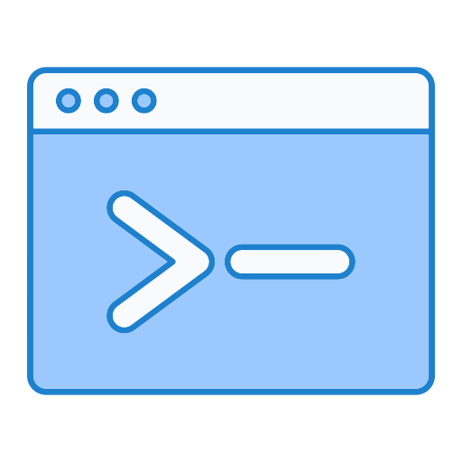]) in the Task GUI toolbar. This button will open a new window with a Jupyter Python Console where you have a Python prompt. Type `response` at the prompt and the image will be shown. You can now further process this image if needed from the Python REPL.

[tabs]
======
Code snippet::
+
[source,python]
----
from pathlib import Path

from gui_executor.exec import exec_task

HERE = Path(__file__).parent.resolve()

@exec_task()
def preview_image(camera: str = "bird_house"):

    from IPython.display import Image, display

    image = Image(filename=HERE / f"{camera}.png")
    display(image)

    return image
----

GUI::
+
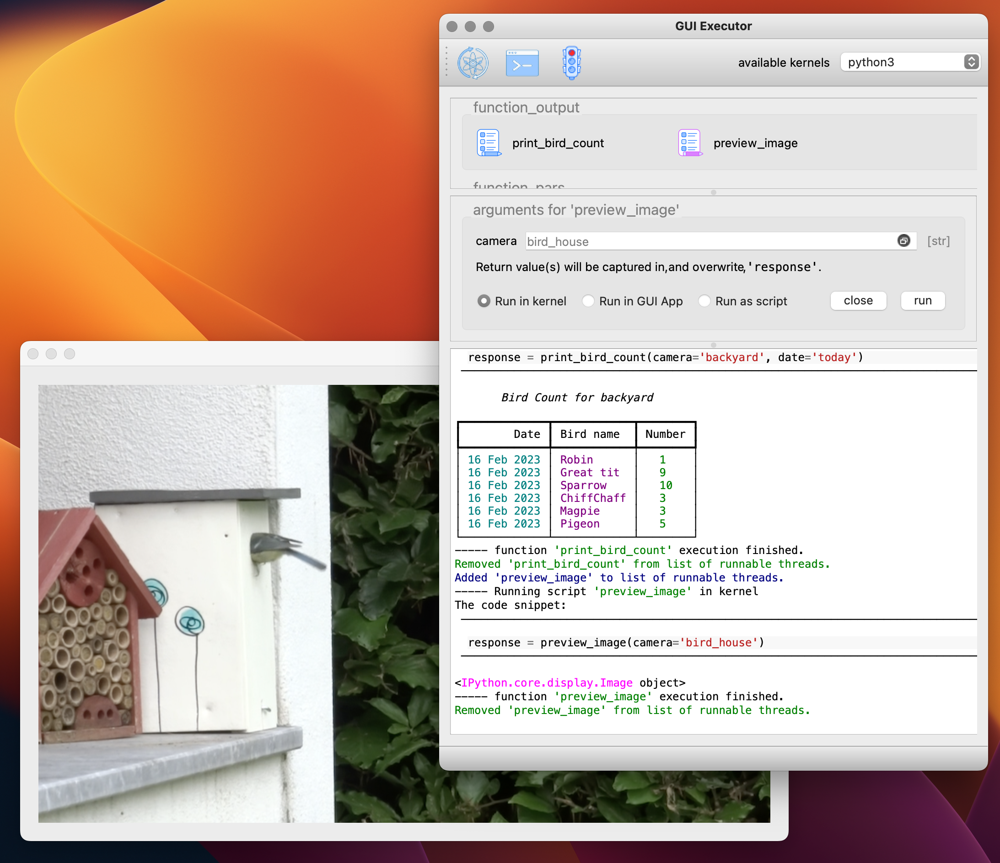

Console::
+
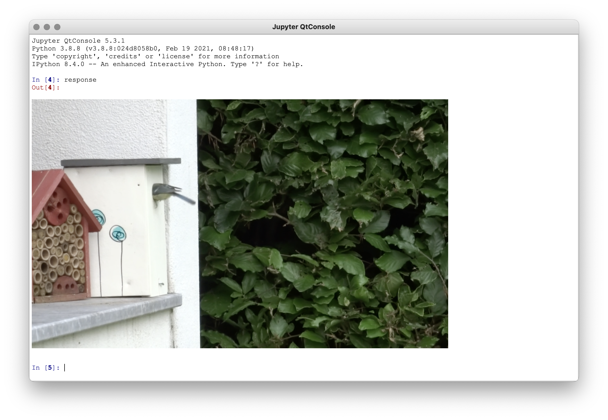

======

TIP: If you want to follow closely on the printed output of your function, you might want to consider using the `flush=True` argument for the `print` function.

=== Advanced Type Hints and Defaults

As a small recap, type hints that are recognised by the Task GUI are: `str`, `int`, `float`, `bool`, `list`, `tuple`, and subclasses of `Enum`. Then, there are a number of types defined by the Task GUI that can be used for paths, i.e. `FileName` as a type for a filename including extension but without the directory part, `FilePath` as a type for a full file path which is the relative or absolute path to a file including the filename and extension, and `Directory` which is the location of a file, i.e. the path to the file without the filename.

Then we have a few special cases for more complex arguments to a function. The first one is a `FixedList` which is a list with a fixed number of elements of specific types. Additionally, there is the `ListList` which is a dynamic list of fixed lists, and finally, there is the `CallBack` type which makes your argument dependent on the outcome of a function call at the moment that you select the task and the arguments panel is created. The following sections will describe these _type hints_ in more detail.

==== The simple fixed list

The `FixedList` is a list of a fixed number of elements of different types. The signature for a FixedList is the following:

[source,pythpn]
----
FixedList(literals: List, defaults: List = None, name: str = None)
----

In practice a `FixedList` is used when the argument to your function is a list with a limited number of arguments, e.g. a list of positions that you want to visit, or the first name, middle initials and last name of a person. In the example below we use a `FixedList` to hold the GPS coordinates where I spotted of a bird.

[tabs]
======
Code snippet::
+
[source%nowrap,python]
----
from gui_executor.exec import exec_task
from gui_executor.utypes import FixedList

@exec_task()
def save_observation(
        coordinates: FixedList([float, float], name="lat, long"),
        time: str,
        bird_name: str,
):
    """
    Saves the observation into the database.

    Args:
        coordinates (list): the longitude and latitude coordinates of the observation (decimal degrees)
        time (str): the time of the observation [YYYY/MM/DD HH:MM:SS]
        bird_name (str): the name of the bird

    """
    print(f"A {bird_name} was spotted at [{coordinates[0]:.6f}, {coordinates[1]:.6f}]")
----

Arguments Panel::
+
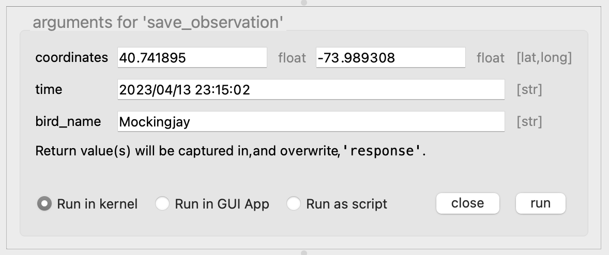
======
Looking at the _Arguments Panel_ tab, the horizontal space after the `coordinates` label will be divided amongst the elements in the list. That's why this type is only useful for a very limited number of inputs.

==== The dynamic list of lists

TBW

==== The call back function

TBW

=== Expert Type Hints and defaults

TBW ->  defining a new type hint

[#capture_response]
=== Capture the result

Since the task that is executed by the GUI is in fact a simple function, it can also return results. These results are normally captured in a variable `response` which is overwritten by new values each time a task is executed from the GUI, even if the task doesn't return anything explicitly in which case `response` will be None.

The developer of the task can decide to capture the result of a task in a different variable or set of variables. This can be specified in the decorator parameter `capture_response` which can be a string or a tuple of strings. See an example below. The task `generate_model` returns three values of which we only need the 'model' and the 'hexhw'. In the `capture_response` you see that the second unused return value is captured in the `\_` and therefore ignored. If you need to ignore more return values, the `*_` is a valid choice.

[tabs]
======
Code snippet::
+
[source,python]
----
from gui_executor.exec import exec_task

UI_MODULE_DISPLAY_NAME = "Capturing function responses"

@exec_task(capture_response=("model", "_", "hexhw"))
def generate_model(name: str = "LDO -> CSL"):

    print(f"Generating model: {name}")

    model = "This is a model"
    s = "an unused return value..."
    hexhw = "this is a reference to a hardware device"

    return model, s, hexhw
----
GUI::
+
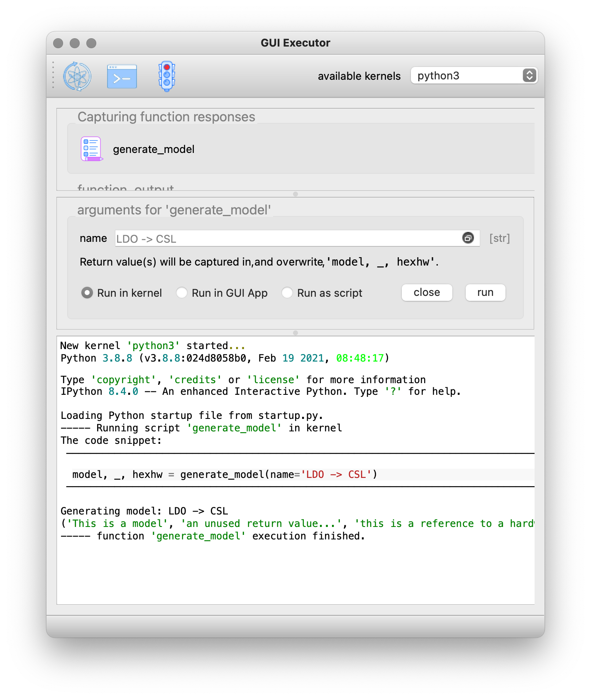

Console::
+
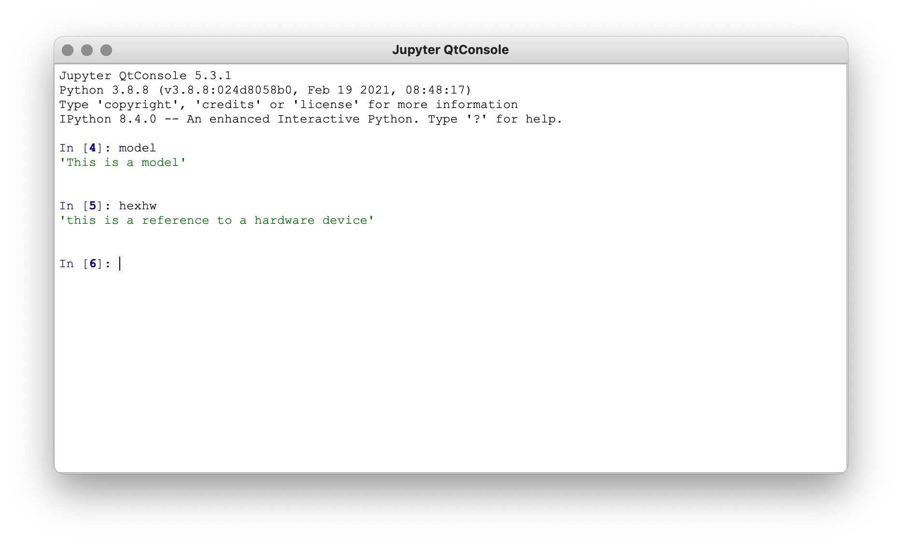

======

The GUI tab above shows the arguments panel when selecting the `generate_model` task. It tells you in which variables the return values will be available, i.e. `model, _, hexhw`. The Console tab shows a screenshot of the Jupyter Console where we inspected the `model` and `hexhw` variables.

Notice that the `capture_response` represents what you would actually write in your Python script when calling the function directly.
----
>>> model, _, hexhw = generate_model()
----

WARNING: Be careful when you use this parameter because it will overwrite the variables that you specify when they already exist in the kernel. The intent of this parameter is to be able to work with the response of a task in a more natural way and have tasks use return variables that are agreed in the project. The danger is that if not used carefully, data can be lost.

=== Choosing your icons

If you do not specify a path for an icon, the Task GUI will use the same icon for all task buttons. This becomes boring very rapidly, but also is error-prone since it will be hard to find your task and the wrong button can be pressed by accident. Looking back at <<csl-task-gui>> you will see that we have created different icons for the different tasks. It gives our Task GUI not only a nice look-and-feel, but also makes it easier to recognise tasks and find the appropriate button.

The icon file type can be `PNG` or `SVG`. The latter is preferred because of its scalability. For a task button we need two icons that represent a normal state of the button and the selected state. By default, the normal state icon is  and the selected state icon is . By convention, the selected state icon is the same as the normal state icon with a different accent of colors. The default icon size is 30×30 pixels.

The icons are specified as a parameter `icons` of the `exec_task` decorator and is a tuple with two Path elements. The first is the normal icon filepath, the second is the selected icon filepath. As an example, the decorator for the `switch_on_camera` task from <<csl-task-gui>>.

[source,python]
----
ICON_PATH = Path(__file__).parent.resolve() / "icons/"

@exec_ui(display_name="Switch ON",
         icons=(ICON_PATH / "n1-camera-swon.svg", ICON_PATH / "n1-camera-swon-selected.svg"))
----

When your task is an _immediate run_ task, only the normal state icon will be used.

=== The Jupyter Kernels

TBW

* The Jupyter QtConsole
* Switching kernels and why
* Creating a new kernel
* Specify which kernel to use on the command line

[#running_tasks]
=== Running your tasks

TBW

* Running in the kernel
* Running as a script
* Running as a GUI App

[#input_requests]
=== Requesting input

TBW

[#init]
=== The \\__init__.py files

The `\\__init__.py` file is usually empty, but can contain a few definitions which are picked up by the Task GUI. If you have several TABs in your GUI with task buttons, these TABs were created from sub-packages. The `\\__init__.py` file for a sub-package can define the `UI_TAB_DISPLAY_NAME` to specify a name for the TAB instead of the package name. The `\\__init__.py` file of the root package, i.e. the one you used with the `--module-path` commandline option, can define the order in which the TABs appear in the Task GUI. Define a list of sub-package names in the variable `UI_TAB_ORDER`. The TABS will appear in that order in the GUI.

Of course, if you have functions that are used by different tasks in seperate modules, you would want to define those functions also in the `\\__init__.py` file.

The `\\__init__.py` file for the project I'm working on currently (see <<csl-task-gui>>) looks like the code given below. We define a function to start the Task GUI with all required options. This function is then used as an _entry_point_ in the `setup.py` file of our project. That way we can start the Task Gui with a simple command `csl_ui`.

[source,python]
----
import os
from pathlib import Path

from executor import ExternalCommand

HERE = Path(__file__).parent.resolve()

UI_TAB_ORDER = ['tests', 'camera', 'gse', 'configuration']

def csl_ui():
    logo_path = HERE / "icons/dashboard.svg"

    # On the client machine, the /data directory is usually mounted read-only.
    # If that is the case, write the command log to the users home folder.

    cmd_log = os.environ.get("UI_LOG_FILE_LOCATION")
    if cmd_log is None or not os.access(cmd_log, os.W_OK):
        cmd_log = str(Path("~").expanduser())

    cmd = ExternalCommand(
        f"gui-executor --verbose --module-path camtest.tasks.csl "
        f"--module-path camtest.tasks.shared.camera "
        f"--kernel-name plato-test-scripts --single "
        f"--logo {logo_path} --cmd-log {cmd_log} --app-name 'CSL Operator GUI'",
        asynchronous=True
    )
    cmd.start()
----

=== The command log

The commandline option `--cmd-log` accepts one argument which must be an existing directory where the command log files will be written. The command log is a file that contains the code line that was executed to run the task, preceded with the timestamp when the task started and followed by the duration, i.e. the time it took to finish the task.

As an example, I reran the `capture_image_camera_name` task again and the entry for this task in the log file looks like this.

[source%nowrap,text]
----
# <-- 2023-04-13 18:45:27.970997+00:00
response = capture_image_camera_name(camera=CameraName.FRONT_DOOR, exposure_time=0.3, aperture=11, filename=PosixPath('visitor.png'), location=PosixPath('~/data/images'))
# --> duration: 0.063239s
----

When an error occurred and an exception is raised, the Exception message is printed in the command log file. The following log entry shows the function `raise_an_exception` that raised a division by zero error.

[source%nowrap,text]
----
# <-- 2023-04-13 19:03:55.841830+00:00
response = raise_an_exception(value=0.0)
# ERROR: float division by zero
# --> duration: 0.037943s
----

The command log file will be located in the folder that was given with the `--cmd-log` commandline argument. There will be only a command log file when the argument is present. The filename will be based on the current date, e.g. `2023-04-13-cmd-log.txt`.

=== Recurring Functions

Apart from tasks that print status information in the output console, there are sometimes specific items that you want to keep track of without the need to execute a task for this. In the project for which this application was developed, we needed to know about two identifiers at all time, i.e. the identifier for the configuration of our equipment (we call it the Setup) and the identifier of the currently running test (we call it the obsid). So, we developed a function which will repeatedly request these identifiers from the microservice that controls the configuration and display them in the status bar at the bottom of the Task GUI. The code snippet below defines a function `show_setup_and_obs_id()` which is decorated with `@exec_recurring_task`. The decorator takes a parameter `status_type` which can be 'NORMAL' or 'PERMANENT'. When `status_type` is NORMAL the message will be printed on the left side of the status bar, when `status_type` is PERMANENT the message will be printed on the right side of the statusbar. The example below is specific for our project, in your case, you will want to put different things in the status bar. The GUI in the TAB shows the output of the function.

[tabs]
======
Code snippet::
+
[source,python]
----
from gui_executor.exec import exec_recurring_task
from gui_executor.exec import StatusType

from egse.state import GlobalState

@exec_recurring_task(status_type=StatusType.PERMANENT)
def show_setup_and_obs_id():
    from egse.confman import ConfigurationManagerProxy
    from egse.obsid import ObservationIdentifier

    obsid: ObservationIdentifier
    with ConfigurationManagerProxy() as cm_proxy:
        if obsid := cm_proxy.get_obsid().return_code:
            test_id = f"OBSID = {obsid.test_id}, "
        else:
            test_id = ''

    return f"{test_id}Setup ID = {int(GlobalState.setup.get_id())}"
----
CSL Operator GUI::
+
image::images/statusbar-01.png[width=80%,align=center]

======

The return value of a recurring task shall be of type `str`. Make sure the string is not too long so it will fit nicely in the status bar.

The recurring task can in principle be defined in any module that is located in the `module-path`, i.e. where also the usual tasks are defined, but it is preferred to have a separate module `recurring.py` to contain the task definition. It is also possible to define more than one recurring task e.g. one with `status_type=NORMAL` and another with `status_type=PERMANENT`. Both functions will be executed in different threads every second.

The recurring functions are executed every second in a separate thread so they don't block the Task GUI. Take care that your recurring function doesn't take longer than a fraction of a second to execute.

== Best Practices

* Write simple tasks with just a few lines of code. Put the code that does the actual work in a separate function or class and call that function from the task body. Basically, the task function should just be a wrapper, with some code to massage the arguments and prepare the return value. The bulk of the work should go into a function that can also be called from within another environment, outside the Task GUI. Don't build your code around the Task GUI, build a Task GUI around your code.
