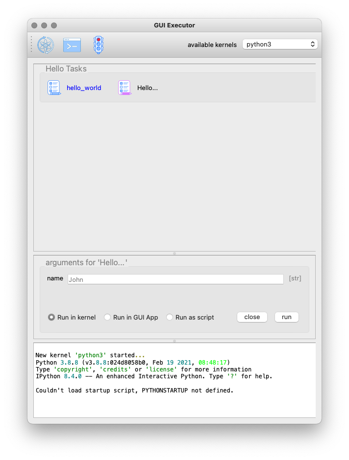

[#tasks-gui]
== The Tasks GUI

The Tasks GUI is a generic GUI that allows the user to execute standard tasks by clicking the task button and provide the necessary arguments. An example of such a Task GUI is given in the screenshot below. This screenshot is taken as an example and showcase from a project I'm working on. In further sections we will create such a task GUI step by step.

.A example Task GUI used in a real project. This type of GUI is generated from seven short Python modules containing simple functions to perform one specific task.

The Task GUI is organised in three panels that are arranged vertically in the window. The top panel is the toolbar to control the Jupyter kernel, the panel at the center contains all the task buttons organised by category, the bottom panel is the console where the output and error messages of the tasks will appear.

When you click on a task button, a fourth panel will appear above the console panel. This is the arguments panel where you can specify all arguments required for the task. Default arguments are shown in gray and can be left to use or overwritten to change. The arguments panel of the selected 'Analyse' task for the 'Circle around optical axis' group is shown below.

.The example Task GUI with arguments panel. The arguemnts panel is automatically generated by the gui-executor from the arguments and type hints of the Python function.

This 'Analyse' task accepts 5 arguments: a list of observation identifiers, the location of the reduced data, an option to save the generated plots in a given output folder, and a flag to make the tasks output more verbose. Since this task will produce plots, we want to execute it as a GUI App. Finally, the 'Close' button hides the arguments panel again and deselects the task button. The 'Run' button executes the task.

In the rest of this document we will explain how such a GUI as above is created and how you can develop your own version for your specific tasks.

=== The package Layout

To build up the Task GUI, we distinguish the task button as a function, several of these functions can be grouped in a Python module (a `.py` file) and all the modules plus additional information needed for the Task GUI is kept in a Python package. The _CSL Operator GUI_ shown above, is located e.g. in the package `camtest.csl` and has the following layout:

----
camtest.csl
   ├──────── __init__.py
   ├──────── camera.py
   ├──────── circle.py
   ├──────── hartmann.py
   ├──────── hexapod.py
   ├──────── huber.py
   ├──────── icons
   ├──────── ogse.py
   ├──────── refmodel.py
   └──────── single.py
----

Each of these `.py` files form a group of buttons in the above Task GUI. The `\\__init__.py` file is special, it defines `camtest.csl` as a package, and it also defines the command to start the Task GUI [see XXXXX]. The `icons` folder contains the graphics for the task buttons and the application icon.

=== Defining a Task

Let's build our own simple Task GUI and start with the most stated and useless function, _Hello, World!_. We will eventually build a Task GUI with tasks of increasing complexity and guide you through the different steps.

Create a folder `yakkafootnote:['yakka' means 'work' in informal Australian English]` that will be our Task GUI package. In the folder create an empty file `\\__init__.py` and a file named `hello.py`.

----
yakka
   ├──────── __init__.py
   └──────── hello.py
----

The `hello.py` file shall contain the following code:

[source, python]
----
from gui_executor.exec import exec_ui

@exec_ui(immediate_run=True) <1>
def hello_world():
    print("Hello, World!")
----
<1> Each task button in the Task GUI is actually a function that is decorated with the `@exec_ui` decorator.

Make sure you are at the same directory level as the `yakka` folder and the execute the following command from your terminal. That will start the Task GUI as shown in the screenshot below.

----
PYTHONPATH=. gui-executor --module-path yakka
----

image::images/yakka-01.png[width=50%,align=center]

We see the task appearing in the screenshot above. The task text is blue which means it will run immediately when clicked. The tasks name is the name of the function and the task group name is the name of the `.py` file. The icon is the standard icon used for the task buttons. When you click the task button, the Console shows the following output:

----
----- Running script 'hello_world' in kernel <1>
The code snippet:
 ──────────────────────────────────────────
  response = hello_world()  <2>
 ──────────────────────────────────────────

Hello, World! <3>
----- function 'hello_world' execution finished. <4>

----
What do we see in this output:

<1> The script is run in the kernel, that is the Jupyter kernel which is started when the Task GUI starts up. By default, the 'python3' kernel is used as you can see in the toolbar.
<2> The code snippet that is run is shown between two horizontal lines. We see that the function is called without arguments and the return is catched in the variable `response` (which is `None` since the function doesn't return anything).
<3> The string 'Hello, World!' is printed when the function was executed.
<4> A mark that the function execution has finished.

Let's add another task that takes an argument 'name' as a string with the default value of "John".

[source, python, subs="+quotes"]
----
from gui_executor.exec import exec_ui

**UI_MODULE_DISPLAY_NAME = "Hello Tasks"**  <1>

@exec_ui(immediate_run=True)
def hello_world():
    print("Hello, World!")

**@exec_ui(display_name="Hello...")  <2>
def hello_you(name: str = "John"):  <3>
    print(f"Hello, {name}!")
**

----
1. if the global variable `UI_MODULE_DISPLAY_NAME` is defined, its value will be used as the name of the group of buttons in this module.
2. You can give the task button a proper name instead of the function name.
3. The type hint for the argument and the default value are used in the arguments panel in the GUI.

In the screenshot above, you can see the effect of the small changes we made in the `hello.py`. The tasks button group is now called 'Hello Tasks' and the new task we added got the 'Hello...' name instead of the function name. The new task icon has a different color because it's is selected. You can also see in the arguments panel that the type hint is picked up and shown in grey and the default name is also filled in grey in the text field. When I put my name there and press the 'Run' button, you can see that the function is called with the proper argument.

// XXXXX: where to describe docstrings and where they show up?

=== The @exec_ui decorator

TBW

* immediate_run
* description
* display_name
* use_kernel, use_gui_app, use_script_app
* input_request
* icons

=== Type Hints and Defaults

TBW

* supported type hints
* defining a new type hint
* ListList
* Callback

=== Choosing your icons

TBW

* PNG or SVG
* normal and selected
* what when `immediate_run=True`

=== The Jupyter Kernels

TBW

* Switching kernels and why
* creating a new kernel

=== Running your tasks

TBW

* Running in the kernel
* Running as a script
* Running as a GUI App

=== The \\__init__.py

TBW

* creating a function to start the GUI in the background
* add the command to the `setup.py`
